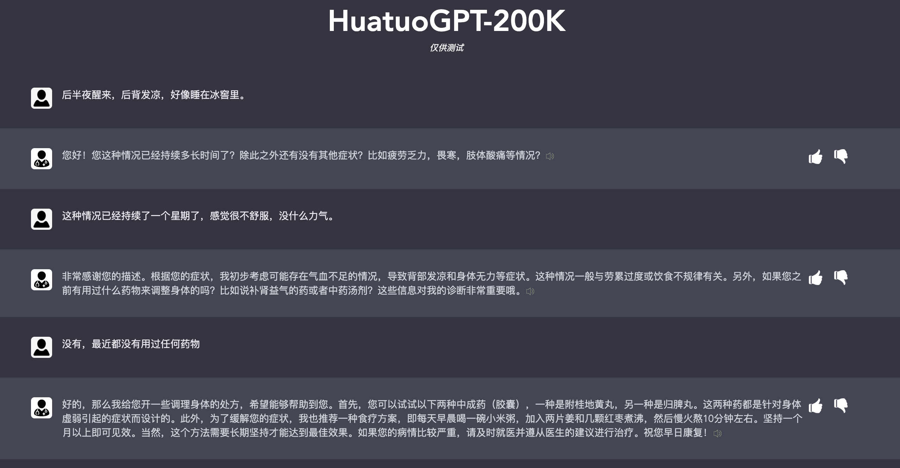

# HuatuoGPT (华佗GPT), Towards Taming Language Models To Be a Doctor.

## 👨‍ Introduction
Welcome to the repository of HuatuoGPT, a large language model (LLM) trained on a vast Chinese medical corpus. Our objective with HuatuoGPT is to construct a more professional ‘ChatGPT’ for medical consultation scenarios. Here is a list of what has been released:

1. Huatuo-200K (Medical Instruction Dataset): a  high-quality instruction dataset that sampled from HuatuoGPT training corpus.
2. Medical-Chat LLMs: weights of a set of popular LLMs trained on our Huatuo-200K.
3. HuatuoGPT: a currently beta-version HuatuoGPT online.
4. Medical evaluation benchmark: an evaluation method used to evaluate several LLMs in medical domain.

Hope our repository will help enhance the field of intelligent medicine and its related applications.

## 💭 Motivation
- To address the growing demand for quick medical consultations both online and in hospitals that do not necessarily require deep medical knowledge. We believe that LLMs like HuatuoGPT can be effectively utilized to meet these demands, freeing up physicians’ time and energy for more complex cases.
- To provide open data for training medical LLMs. Building high-quality instruction training data for LLMs is essential, but it can be also challenging. We have constructed medical instruction data using various methods and made it publicly available. This dataset can be combined with other datasets to train one's own medical 'ChatGPT'.
- To emphasize the importance of carefully evaluating the ability of medical LLMs before using them to offer medical assistance to patients. We recognize the potential benefits of LLMs in the medical field, but also acknowledge the need for thorough evaluation and testing to ensure patient safety and accurate diagnoses.

## 📚 Data

### Data Examples:
We have gathered hundreds of billion tokens of online data to create a high-quality medical training corpus for HuatuoGPT. We also selected 200K pieces from this dataset as medical instruction data, named Huatuo-200K. This subset is adequate for fine-tuning LLMs to create ChatGPT-like consultant models. We are releasing this resource to the public, enabling anyone to train their very own intelligent doctor. 

| Category                             | Scale | Descriptions                                                 | Examples                                                     |
| ------------------------------------ | ----- | ------------------------------------------------------------ | ------------------------------------------------------------ |
| Distilled Instructions from ChatGPT  | 61,400   | Medical instructions generated with self-instruct. Seed instructions are manually written by us. | 💬：现在该做什么准备手术前的身体检查？ 👨‍⚕️：在准备手术前的身体检查中，需要进行以下几个步骤： &emsp;&emsp;1. 了解病人的病史：了解病人的病史，包括既往病史、手术史、药物过敏史、家族病史等，以便评估手术风险和制定手术方案。 &emsp;&emsp;2. 进行体格检查：进行全面的体格检查，包括测量身高、体重、血压、心率、呼吸… |
| Real-world Instructions from Doctors | 69,768  | Medical single-round medical consultants in real-world scenarios, in which the doctor's response is more specific and can address the user's medical concerns. | 💬：我有糖尿病血压160-90.该吃什么降压药？空腹血糖8左右。餐后11左右。我有糖尿病血压160-90.该吃什么降压药？ 👨‍⚕️：阅读你的提问描述，综合分析症状，体征，糖尿病，血压160-90.血压略高，空腹血糖8左右。餐后11左右。血糖略高。口服依那普利，二甲双胍片治疗，新近研究，二甲双胍片，可以抑制食欲，促进肠道蠕动，预防癌症，预防心脑血管病，延长寿命作用。 |
| Distilled Conversations from ChatGPT     | 68,888   | Medical multi-round conversations in real-world scenarios. Conversations include multiple rounds of questioning by doctors and continuous questioning by patients. | 💬：User: 我想问一下大夫，我发烧三天后，第四天全身起了疹子，是怎么回事呢？ 👨‍⚕️：~您好！感谢您的提问。您的症状可能与幼儿急疹相关。幼儿急疹是一种常见的儿童病，病因为人类疱疹病毒6型或7型感染引起。它的症状包括：  1. 发热 n2. 全身起红色疹子   3. 口腔内及咽喉部有小水泡  4. 病程一般为3-5天左右... 💬：谢谢大夫！除了幼儿急疹还有其他可能吗？我之前有感冒，这和疹子有关系吗？ 👨‍⚕️：除了幼儿急疹，病毒性感冒和其他病毒感染也有可能引起疹子，但这种情况相对较少见。在您的情况下，感冒可能是一种诱发因素，但主要还是由病毒感染引起的疹子... |
| Real-world Conversations with Doctors      | 25,986   | Medical multi-round conversations in real-world scenarios. Conversations include multiple rounds of questioning by doctors and continuous questioning by patients. | 💬：额头下巴下长满痘痘。就是不知道. 👨‍⚕️：你好，有什么困扰吗？我可以为你提供帮助。请问您平时的饮食习惯、睡眠和护肤习惯怎样？化妆品和防晒霜的使用频率如何？还有洁面的频次是怎样的呢？ 💬：平时我基本上只是用水乳霜，然后洗面奶只用一种。日常防晒只有在夏天时会使用，我一般用悦诗风吟的洗面奶以及AHC的护肤产品，这些都比较温和。 👨‍⚕️：谢谢您的描述。首先，建议您停用化妆品和普通护肤品，使用特定的药妆品牌，如雅漾和理肤泉的洁面泡沫或洁面乳，并避免使用热水或肥皂清洗面部。建议您外用阿达帕林凝胶涂于面部痤疮，一般夜间使用，涂抹十五分钟之后外用医学护肤品比如雅漾、薇资、理肤泉清爽型的舒缓面霜，或者是维生素e乳膏… |

### Data Usage:
- Huatuo200K

  

## Models

- HuatuoGPT

  

## Demo

## Evaluations
- 

## HuatuoGPT

See our model in [https://www.huatuogpt.cn/](https://www.huatuogpt.cn/). Note that it is still in progressing.

## Limitations

Our goal with HuatuoGPT is to address the need for quick medical consultations, rather than replace doctors or provide full medical support to patients. However, our model does have several limitations that must be taken into consideration:

- Misunderstandings: As with all language models, there is a risk of misunderstandings or misinterpretations, especially when dealing with medical jargon or complex conditions. In this scenario, our models may give wrong answers.
- Hallucinations: Large language models can sometimes generate responses that do not make sense or are completely unrelated to the given input. These "hallucinations" can be especially problematic when users are not familiar with the concepts being discussed, as they may not be able to easily recognize the errors in the model's output. These "hallucinations" can be a challenge to detect and avoid.
- Bias: LLMs are trained on large datasets, which can inadvertently introduce bias into the model's responses. Additionally, care should be taken to ensure that the model is not used to perpetuate biases in medical treatment.

## Acknowledgement

## References

HuatuoGPT, taming Language models to follow medical instructions in conversation.

Less is more, taming Language models to follow medical instructions in conversation using 200k samples.

